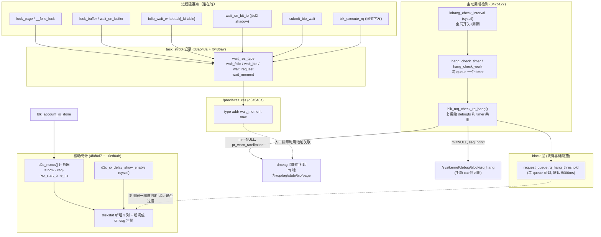

# block: slow-io-check —— IO 慢请求 / hang 检测机制

共 6 个提交，跨度从 2024-02（anolis 云内核项目引入）到 2026-07（后续扩展）。

```
d3a548a anolis: fs: record page or bio info while process is waitting on it
4f0f0d7 anolis: block: add counter to track io request's d2c time
16ed0ab block: add a sysctl parameter to control d2c show
342b127 block: add periodic iohang detection with sysctl control
f6486a7 block: extend wait_res for I/O hang detection
c4cce6d block: move iohang_check_interval and d2c_io_delay_show_enable sysctl to block subsystem
```

## 涉及的代码路径

```
linux/
├── block/
│   ├── bio.c                 # submit_bio_wait() 记录 wait_res
│   ├── blk-core.c            # 每 queue 的 hang_check_timer / hang_check_work
│   ├── blk-mq.c              # blk_execute_rq() 记录 wait_res；blk_account_io_done() 累加 d2c_nsecs 并做超阈值告警
│   ├── blk-mq-debugfs.c      # blk_mq_check_rq_hang() / rq_hang 的双 sink（debugfs 读 or 定时器 dmesg）
│   ├── blk-mq-debugfs.h      # struct blk_hang_show_ctx
│   ├── blk-sysctl.c          # 新增：block 子系统自己的 sysctl 命名空间
│   ├── blk.h                 # 内部声明
│   ├── genhd.c               # /proc/diskstat、/sys/.../stat 里的 d2c 字段
│   └── Makefile
├── fs/
│   ├── proc/base.c           # /proc/<pid>/wait_res 接口
│   └── jbd2/transaction.c    # do_get_write_access() 记录 wait_res
├── mm/
│   ├── filemap.c             # __folio_lock() 记录 wait_res
│   └── page-writeback.c      # folio_wait_writeback[_killable]() 记录 wait_res
├── include/linux/
│   ├── sched.h                # task_struct 新增 wait_res_type/wait_folio|wait_bio|wait_request/wait_moment
│   ├── buffer_head.h          # wait_on_buffer()/lock_buffer() 记录 wait_res
│   ├── blkdev.h               # request_queue 新增 hang_check_timer/work
│   └── part_stat.h            # disk_stats 新增 d2c_nsecs[]
├── kernel/sysctl.c            # 早期版本临时挂过 iohang_check_interval/d2c_io_delay_show_enable，后被 c4cce6d 移走
└── Documentation/admin-guide/iostats.rst
```

这 6 个提交依赖一个**已经存在**的基础设施，没有它就无法理解 342b127 为什么能直接复用：

```c
// include/linux/blkdev.h
#define BLK_REQ_HANG_THRESHOLD  5000   // 默认 5000ms

struct request_queue {
    unsigned int rq_hang_threshold;    // 每个 queue 可独立配置（block/blk-sysfs.c）
    ...
};

// block/blk-mq-debugfs.c（本特性之前就有）
{ "rq_hang", 0400, queue_rq_hang_show, NULL },   // debugfs: 手动 cat 才触发一次扫描
```

即：内核里早就有 `/sys/kernel/debug/block/<dev>/rq_hang`，管理员手动 cat 一次，会遍历该 queue 上所有 in-flight 的 request，把 `duration = now - rq->start_time_ns >= rq_hang_threshold` 的请求详情打印出来。**slow-io-check 这组补丁做的事情，就是把这个"被动、单次、手动"的能力，改造成"主动、周期性、可关联到具体阻塞进程"的一整套诊断链路。**

---

## 一、整体架构



**排障使用方式**（这是设计这套机制的初衷，commit message 里写得很直白）：

1. 发现某进程 D 状态卡住不动，`cat /proc/<pid>/wait_res` 拿到它在等的 page/bio 地址、已经等了多久；
2. 拿这个地址去 `/sys/kernel/debug/block/<dev>/rq_hang`（或 342b127 之后周期性打到 dmesg 里的信息）里搜，找到对应的 request；
3. request 详情里有 op/tag/state/bio/page 列表，能判断这个 IO 卡在 driver 侧、卡在 queue 里，还是压根没有对应的 in-flight request（那就是页锁被别的进程持有，而不是磁盘慢）；
4. 结合 `d2c_nsecs`（driver 侧 dispatch-to-complete 时延，即 iostat 传统 await 覆盖不到的"设备驱动这一段"时延）判断是否是底层盘慢。

---

## 二、逐个提交分析

### 1. `d3a548a` anolis: fs: record page or bio info while process is waitting on it

**问题**：进程卡在 `wait_on_buffer()`/`lock_buffer()`/`lock_page()`/`wait_on_page_writeback()`/`wait_on_bit_io()` 里，从外部只能看到 `D` 状态和一个内核栈，分不清究竟是"页在被 IO"还是"页被别的进程锁住太久没释放"。

**实现**：在 `task_struct` 里加一个"当前正等待的资源"字段（联合体，同一时刻只可能等一种资源），进入等待前 `task_set_wait_res()`，退出后 `task_clear_wait_res()`：

```c
// include/linux/sched.h
enum {
    TASK_WAIT_FOLIO = 1,
    TASK_WAIT_BIO,
};

int wait_res_type;
union {
    struct folio *wait_folio;
    struct bio   *wait_bio;
};
unsigned long wait_moment;   // jiffies，记录开始等待的时刻
```

埋点位置：`__folio_lock()`（mm/filemap.c）、`wait_on_buffer()`/`lock_buffer()`（include/linux/buffer_head.h）、`submit_bio_wait()`（block/bio.c）、jbd2 的 shadow buffer 等待（fs/jbd2/transaction.c）。

暴露接口：`/proc/<pid>/wait_res`（同时挂在 tgid 和 tid 两套 `pid_entry` 数组上），输出 `类型 地址 等待起始jiffies 当前jiffies`：

```c
static int proc_wait_res(struct seq_file *m, ...)
{
    seq_printf(m, "%d %px %lu %lu\n", task->wait_res_type, task->wait_folio,
               task->wait_moment, jiffies);
    return 0;
}
```

注意这里的 `wait_folio`/`wait_bio` 是联合体的同一块内存，取哪个字段完全由第一个数字（`wait_res_type`）决定——这是个纯观测性接口，只给管理员肉眼读，不做内核内部的类型安全解析。

### 2. `4f0f0d7` anolis: block: add counter to track io request's d2c time

**问题**：`iostat` 的 await 是"进入 block 层排队到完成"的总时延，掺杂了 IO 调度器排队时间，掩盖了"设备驱动实际处理"这一段的真实延迟。

**实现**：在 `disk_stats` 里加一组 `d2c_nsecs[NR_STAT_GROUPS]`，在请求完成时统计"dispatch 到 complete"这段时间（`io_start_time_ns` 是驱动真正开始处理的时间戳，区别于 `start_time_ns` 这个"进 block 层排队"的时间戳）：

```c
// block/blk-mq.c: blk_account_io_done()
if (req->rq_flags & RQF_STATS) {
    part_stat_add(req->part, d2c_nsecs[sgrp],
                  now - req->io_start_time_ns);
}
```

在 `/proc/diskstat` 和 `/sys/block/<dev>/stat` 里各追加 3 个字段（read/write/discard 的 d2c 毫秒数），这也是这个特性在 2019 年以 `[RFC] block: add counter to track io request's d2c time` 投过 LKML、但只被问了一句"能不能配套出个 iostat patch"就没了下文、从未合入主线的那次尝试的原始想法（详见文末"上游状态"）。

### 3. `16ed0ab` block: add a sysctl parameter to control d2c show

**问题**：直接给 `/proc/diskstat` 多插 3 列，会让任何按固定字段数解析这个文件的老工具（不遵循"读到啥算啥"原则的脚本）解析失败。

**实现**：
- 新增 `sysctl kernel.d2c_io_delay_show_enable`（默认 0），只有开启后 `/proc/diskstat`、`/sys/.../stat` 才输出那 3 个字段，否则连逗号都不多打一个，保持原有格式字节级兼容；
- 顺便在 `blk_account_io_done()` 里，只要开了这个开关，就把 `rq_hang_threshold`（前面提到的、per-queue 早已存在的字段）借用为 d2c 的超时阈值——d2c 时延一旦超过它，直接 `pr_warn_ratelimited` 一条 dmesg，不需要等定时器扫描：

```c
if (req->rq_flags & RQF_STATS && d2c_io_delay_show_enable) {
    u64 d2c = now - req->io_start_time_ns;
    part_stat_add(req->part, d2c_nsecs[sgrp], d2c);
    unsigned int d2c_ms = div_u64(d2c, NSEC_PER_MSEC);
    unsigned int thresh = req->q->rq_hang_threshold;   // 复用已有阈值，没单独加一个
    if (d2c_ms > thresh) {
        part_stat_unlock();
        pr_warn_ratelimited("d2c_io_delay: dev %s op %d d2c %u ms exceeds threshold %u ms\n", ...);
        return;
    }
}
```

这是"请求完成时**回溯性**告警"——只能事后发现，如果请求一直不完成（真 hang 住），这条路径永远不会被触发，这就是下一个提交要解决的问题。

### 4. `342b127` block: add periodic iohang detection with sysctl control（核心提交）

**问题**：3 号提交只能在请求**完成后**才知道它慢；如果请求卡住根本不完成（这才是"hang"最典型的场景），就必须靠管理员手动 `cat rq_hang` 才能发现，无法做到主动上报。

**实现**：给每个 `request_queue` 挂一个定时器 + workqueue：

```c
// include/linux/blkdev.h
struct request_queue {
    struct timer_list   hang_check_timer;
    struct work_struct   hang_check_work;
};

// block/blk-core.c
static void blk_hang_check_timer(struct timer_list *t)
{
    struct request_queue *q = from_timer(q, t, hang_check_timer);
    if (hang_check_interval) {
        mod_timer(&q->hang_check_timer, jiffies + msecs_to_jiffies(hang_check_interval));
        kblockd_schedule_work(&q->hang_check_work);   // 定时器上下文不能做重活，丢给 workqueue
    }
}

static void blk_hang_check_work(struct work_struct *work)
{
    struct request_queue *q = container_of(work, struct request_queue, hang_check_work);
    if (!hang_check_interval || !q->rq_hang_threshold)
        return;
    if (!percpu_ref_tryget(&q->q_usage_counter))   // 防止 queue 正在被 freeze/删除时踩空
        return;
    ctx.now = blk_time_get_ns();
    ctx.m = NULL;                                   // 关键：m=NULL 表示这次不是 debugfs 读
    blk_mq_queue_tag_busy_iter(q, blk_mq_check_rq_hang, &ctx);
    blk_queue_exit(q);
}
```

最巧妙的部分是**复用**了本就存在的 `rq_hang` debugfs 扫描逻辑，而不是重新写一遍。把原本假设"一定在 seq_file 上下文里"的 `blk_mq_debugfs_rq_hang_show()` 改造成一个双 sink 的打印宏：

```c
// block/blk-mq-debugfs.c
static void blk_debug_puts(struct seq_file *m, const char *str)
{
    if (m) seq_puts(m, str);
    else    pr_warn_ratelimited("%s", str);
}
#define blk_debug_printf(m, fmt, ...) \
    do { if (m) seq_printf(m, fmt, ##__VA_ARGS__); \
         else    pr_warn_ratelimited(fmt, ##__VA_ARGS__); } while (0)
```

这样 `blk_mq_check_rq_hang()` 一份代码，`ctx->m != NULL` 时走 `seq_printf`（debugfs 手动 cat 场景），`ctx->m == NULL` 时走 `pr_warn_ratelimited`（周期性定时器场景，直接进 dmesg），两条路径共享同一个"判断 duration 是否超过 rq_hang_threshold + 打印 op/tag/state/bio/page 详情"的实现，没有逻辑分叉的维护成本。

全局开关通过 `sysctl kernel.iohang_check_interval`（单位 ms，最小 1000ms，防止设太小拖垮性能）控制，写入时触发 `blk_set_all_hang_check_timers()` 遍历 `block_class` 下所有磁盘设备，统一启停每个 queue 的 timer：

```c
void blk_set_all_hang_check_timers(bool start)
{
    class_dev_iter_init(&iter, &block_class, NULL, &disk_type);
    while ((dev = class_dev_iter_next(&iter))) {
        q = dev_to_disk(dev)->queue;
        if (q) start ? blk_start_hang_check_timer(q) : blk_stop_hang_check_timer(q);
    }
}
```

用法（commit message 原文）：

```
echo 30000 > /proc/sys/kernel/iohang_check_interval   # 每 30s 扫一遍所有 queue
echo 0     > /proc/sys/kernel/iohang_check_interval   # 关闭
```

### 5. `f6486a7` block: extend wait_res for I/O hang detection

**补洞**：wait_res 机制（提交 1）当时漏了两处：

1. `blk_execute_rq()`（同步下发 request，比如 ioctl 透传命令）阻塞等待完成时没有记录 wait_res，加了新的资源类型 `TASK_WAIT_REQUEST`：

```c
enum {
    TASK_WAIT_FOLIO = 1,
    TASK_WAIT_BIO,
    TASK_WAIT_REQUEST,      // 新增
};
// task_struct 里 wait_request 与 wait_folio/wait_bio 同一个联合体
```

```c
// block/blk-mq.c: blk_execute_rq()
task_set_wait_res(TASK_WAIT_REQUEST, rq);
wait_for_completion_io(&wait.done);   // 或 timeout 版本
task_clear_wait_res();
```

这一处让 wait_res 能直接记录 `struct request *`，不用再像之前那样只能记 page/bio 反过来猜 request——跟提交 4 的 rq_hang 周期扫描形成直接对应关系。

2. `folio_wait_writeback()`/`folio_wait_writeback_killable()`（mm/page-writeback.c）之前完全没有埋点（回读 d3a548a 的 diff 会发现只加了 `__folio_lock`，漏了 writeback 等待路径），这次补上，且注意 `_killable` 版本在提前返回 `-EINTR` 的分支里也要记得 `task_clear_wait_res()`，避免残留脏状态污染下一次等待的判断。

### 6. `c4cce6d` block: move iohang_check_interval and d2c_io_delay_show_enable sysctl to block subsystem

**纯粹的命名空间整理**，不涉及功能变化：把提交 3、4 里临时挂在 `kernel/sysctl.c`（`/proc/sys/kernel/*`）下的两个参数搬到新建的 `block/blk-sysctl.c`，注册到独立的 `/proc/sys/block/*` 命名空间：

```c
// block/blk-sysctl.c (新文件)
static int __init blk_sysctl_init(void)
{
    register_sysctl_init("block", block_table);
    return 0;
}
core_initcall(blk_sysctl_init);
```

之前这两个参数硬编到通用的 `kern_table[]` 里，且用 `#ifdef CONFIG_BLOCK` 包裹、外部变量靠 `extern` 声明在多个 .c 文件里手动同步（`block/blk-core.c` 顶部甚至有一行孤零零的 `extern int hang_check_interval;`），这次顺带清理掉了这些 extern 声明，改为 `block/blk.h` 里统一声明。用户可见的变化是 `/proc/sys/kernel/iohang_check_interval` → `/proc/sys/block/iohang_check_interval`（`d2c_io_delay_show_enable` 同理），Documentation 也同步改了路径。

---

## 三、三条互补的观测链路（小结）

| 链路 | 提交 | 触发时机 | 输出位置 | 回答的问题 |
|---|---|---|---|---|
| 进程侧等待记录 | d3a548a, f6486a7 | 进程进入 lock_page/wait_on_buffer/... | `/proc/<pid>/wait_res` | "这个卡住的进程在等哪个 page/bio/request，等了多久" |
| 请求完成时统计 | 4f0f0d7, 16ed0ab | 请求 complete（`blk_account_io_done`） | `/proc/diskstat`、`/sys/.../stat`、dmesg | "驱动侧处理时延（d2c）历史分布如何，有没有单次超阈值" |
| 请求 in-flight 主动巡检 | 342b127 | 定时器周期触发（`hang_check_timer`） | debugfs `rq_hang`（原有，被复用）、dmesg（新增） | "现在这一刻，有没有请求已经卡了超过阈值还没完成" |

三者共用同一个已有的 per-queue `rq_hang_threshold`（`BLK_REQ_HANG_THRESHOLD` 默认 5000ms，`block/blk-sysfs.c` 可调）作为"多久算慢/算 hang"的统一标准，没有再引入第二套阈值配置。整体思路是最大化复用已有的 debugfs 扫描代码和 sysfs 阈值配置，新增的主要是"定时驱动"和"进程侧关联"这两层。

## 四、上游合入状态

详见团队内部讨论，简要结论：

- d2c 计数器部分：2019-06-04 以 `[RFC] block: add counter to track io request's d2c time` 投过 linux-block@vger.kernel.org。Chaitanya Kulkarni（Oracle）问了句"能不能配个 iostat patch"，作者回复"稍后补"，此后再无 v2、无 maintainer ack，**未合入 mainline**。
- 其余 5 个提交（含 wait_res 整套机制、周期性 hang 检测、sysctl 重命名空间）**从未投递过 LKML**，均为下游（anolis 云内核）专属特性。
